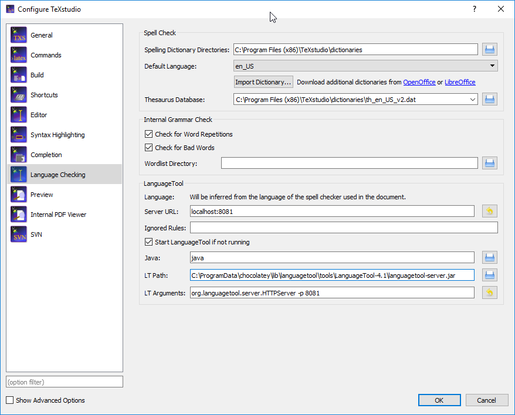

# Recommended LaTeX environments

## Offline usage

Grammar and spell checking is available at [TeXstudio].
Please download [LanguageTool] and [configure TeXstudio to use it](http://wiki.languagetool.org/checking-la-tex-with-languagetool#toc4).
Note that it is enough to point to `languagetool-server.jar`.

**If TeXstudio doesn't fit your need, check [the list of all available LaTeX Editors](http://tex.stackexchange.com/questions/339/latex-editors-ides).**

Use [JabRef] to manage your bibliography.
Quick installation using [Chocolatey]: `choco install texstudio languagetool jabref`.

A comparison to other literature management software is available at <https://ultimate-comparisons.github.io/ultimate-reference-management-software-comparison/>.
See [LaTeX Editors/IDEs question on TeX.SX](http://tex.stackexchange.com/questions/339/latex-editors-ides) for a complete list of LaTeX editors.

## Installation hints for Ubuntu

- From Ubuntu 18.10 onwards, the basic version of the template works without issues.
  Advanced usages such as cool syntax highlighting with [minted](https://www.ctan.org/pkg/minted) needs more configuration.
- Ubuntu 16.04 [ships biber 2.4](https://bugs.launchpad.net/ubuntu/+source/biber/+bug/1589644), so you have to upgrade your texlive distribution.
  The easiest way is to uninstall the ubuntu package and use [install-tl-ubuntu](https://github.com/scottkosty/install-tl-ubuntu).
  Then, you can follow the instructions given at <http://tex.stackexchange.com/a/55459/9075> to update your texlive distribution.
  If you do not want to have an updated installation, but fiddle around with dirty patching your installation, please follow  <http://tex.stackexchange.com/questions/84624/how-to-upgrade-biblatex-properly>.

Always working solution: Use the [docker image](https://gitlab.com/islandoftex/images/texlive#tex-live-docker-image).
This provides a perfectly configured latex distribution with all required tools.

1. Execute `sudo visudo` to edit the sudoers file
1. Add the line `myusername ALL = (root) NOPASSWD: /usr/bin/docker`. Replace `myusername` accordingly. (Source: <https://unix.stackexchange.com/a/13058/18033>)
1. Execute `sudo docker pull registry.gitlab.com/islandoftex/images/texlive:latest`.
   This should not ask for any password.
   Will download approx. 4GB.
1. Open TeXstudio
1. Options > Configure TeXstudio > Commands
1. Set "PdfLaTeX" to `docker run --rm -v DIROFTEXDOCUMENT:DIROFTEXDOCUMENT --workdir=DIROFTEXDOCUMENT registry.gitlab.com/islandoftex/images/texlive:latest pdflatex --shell-escape -synctex=1 -interaction=nonstopmode %.tex`, replace `DIROFTEXDOCUMENT` by the directory of your latex document. Example: `/home/user/thesis`.
1. Set "LuaLaTeX" to `docker run --rm -v DIROFTEXDOCUMENT:DIROFTEXDOCUMENT --workdir=DIROFTEXDOCUMENT registry.gitlab.com/islandoftex/images/texlive:latest lualatex --shell-escape -synctex=1 -interaction=nonstopmode %.tex`, replace `DIROFTEXDOCUMENT` by the directory of your latex document. Example: `/home/user/thesis`.
1. Set "Biber" to `docker run --rm -v DIROFTEXDOCUMENT:DIROFTEXDOCUMENT --workdir=DIROFTEXDOCUMENT registry.gitlab.com/islandoftex/images/texlive:latest biber %`, replace `DIROFTEXDOCUMENT` by the directory of your latex document. Example: `/home/user/thesis`.
1. Check if the "docker pull" command from step 3 succeed. If not, wait.
1. Try to press the "Compile" (<kbd>F6</kbd>) button in TeXstudio.

## Installation hints for Windows

Note: The default installation of MiKTeX might ship with incompatible biblatex and biber packages.
**You have to keep your MiKTeX up to date.**
In case you followed the linked installation steps, you only have to run "Update MiKTeX".
If you installed MiKTeX other ways, you have to run "Update MiKTeX (Admin)" and "Update MiKTeX" and check in both tools for updates (see <http://tex.stackexchange.com/a/108490/9075>).
  
### Preparations

1. Install [chocolatey]:
    1. Open `cmd.exe` as Administartor
    2. Paste and hit <kbd>Enter</kbd> `@"%SystemRoot%\System32\WindowsPowerShell\v1.0\powershell.exe" -NoProfile -InputFormat None -ExecutionPolicy Bypass -Command "iex ((New-Object System.Net.WebClient).DownloadString('https://chocolatey.org/install.ps1'))" && SET "PATH=%PATH%;%ALLUSERSPROFILE%\chocolatey\bin"`
1. Execute `choco feature enable -n=allowGlobalConfirmation` to get rid off additional installation confirmations.
1. Execute `choco install texstudio sumatrapdf.install strawberryperl jre8 jabref languagetool` to install necessary tooling.
1. In case [PlantUML](http://plantuml.com/) should be used, follow the installation instructions at <https://koppor.github.io/plantuml/> listed at the "pre-conditions" section.
1. For more recommended tooling see <https://github.com/koppor/koppors-chocolatey-scripts>.

### Recommended setup of MiKTeX

1. Download the basic installer from <http://miktex.org/download>
1. Start it
1. First screen: Read the license conditions and be sure that you really agree.
    - Check "I accept the MiKTeX copying conditions"
    - Click "Next"
1. Second screen: "Shared Installation": Install MiKTeX for: "Only for: `username`".
    - Check first option
    - Click "Next"
1. Third screen: "Installation Directory": Install MiKTeX to: `C:\MiKTeX`. This enabled browsing for documentation at `C:\MiKTeX29\doc\latex`
    - Input "C:\MiKTeX" in the input field
    - Click "Next"
1. Fourth screen: "Settings": Preferred paper: A4 and install missing packages on the fly.
    - First combo box: "A4"
    - Second combo box: "Yes":
    - Click "Next"
1. Fifth screen: Press "Start"
1. Now a window "Executing" appears. It will take about 5 minutes until this is finished.
1. At the last screen: Click "Close"
1. After the installation:
     1. Open `cmd.exe`
     2. Execute `refreshenv` to make MiKTeX's binaries known right after the installation
     3. Execute `mpm --update-db`
     4. Execute `mpm --update`
     5. Execute `mpm --install=tex-gyre` (to resolve `fontspec error: "font-not-found"`, `\setmainfont{TeX Gyre Termes}`)
     6. Execute `mpm --install=tex-gyre-math`
     7. Execute `mpm --install=cm-super`
     8. Execute `initexmf --update-fndb` (ensure that no other MiKTeX tooling such as the [MiKTeX Console](https://miktex.org/howto/miktex-console) is run in parallel - see <https://github.com/MiKTeX/miktex/issues/98#issuecomment-375952270>)
     9. Execute `initexmf --mklinks --force`

[chocolatey]: https://chocolatey.org/
[JabRef]: https://www.jabref.org
[LanguageTool]: https://languagetool.org/
[TeXstudio]: http://texstudio.sourceforge.net/
